# Wind-Blade-Inspection

## Synopsis

This repository is a part of my MSc Masters' thesis which addresses autonomous inspection of wind blades using computer vision combined with structured light to accurately segment and detect wind blade edges. The method is invariant to both rotation and scale, while it is computationally efficient for use on real-time applications. The blade edges will be detected according to the segmented area of the blade, and identified as Hough transformed lines to easily follow a manouvering scheme which intends to follow the blade edges from root to tip, while maximizing the view of the blade without loosing view of the respective edges. It will also be shown that the method detects the blade tip, regardless of rotation and scale.

Furthermore, the structured light will be utilized to efficiently compute feature point matches from a stereo vision system. These matches will be used to conduct 3D reconstruction of the respective feature points using 2D triangulation. This will enable transformation of coordinates between the image frame and camera frame, including a real-time estimate of the distance to the blade.

Please read the full report which is included in this repository for further details.
* Autonomous_Wind_Blade_Inspection_MSc_thesis.pdf

## Results

In short, the software segments the wind blade using the grid points, then detects and identifies the blade edges using Hough line transformation on a limited set of feature points along the blade edges to improve accuracy and efficiency.
Some results are shown below, where the orange arrow shows the estimated heading which aims to follow the direction of the blade.

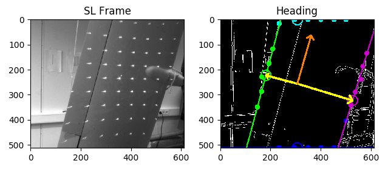

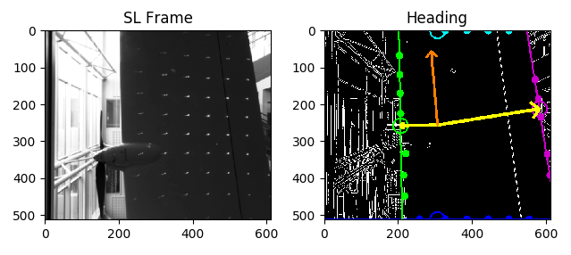

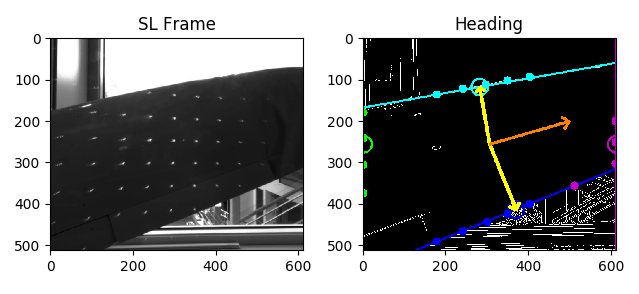

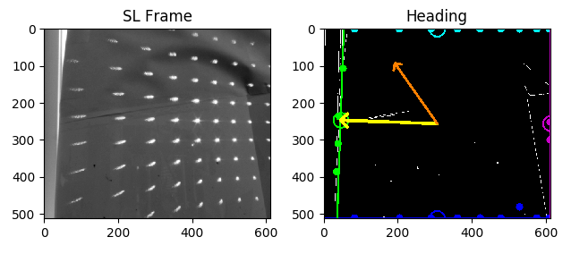

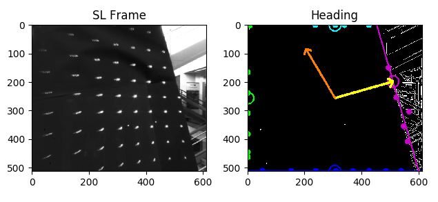

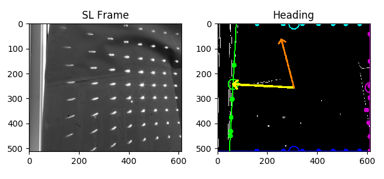

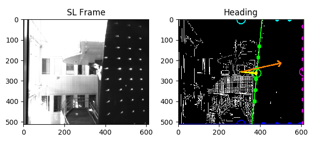

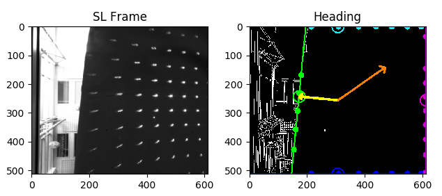

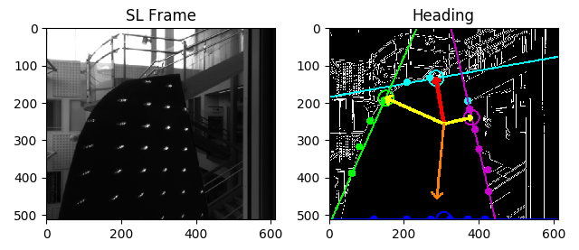

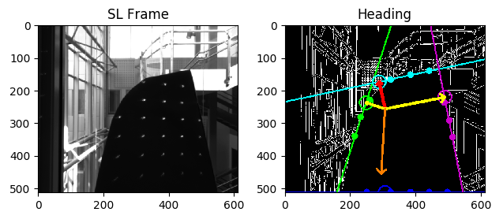

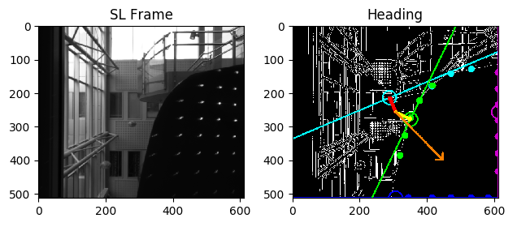

## Installation

The software is written in python 2.7, and depends on using two odroid-XU4, which acts as master and slave, two PtGrey Chameleon3.0 cameras and a laser with TTL functionality and a dot matrix diffraction option. Please see the 'Autonomous_Wind_Blade_Inspection_MSc_thesis.pdf' report for further hardware details and software explanations, and follow the installation steps described in 'HOWTO.txt' to install all necessities. However, the software may also be run on a local computer, although, only test samples may be runned.

## Usage

* Get information on how to use the software:

```
sudo python main.py info
```

* Run the program with stored video sample:

```
sudo python main.py run simulate video
```

* Or use an image sample:

```
sudo python main.py run simulate image
```

* If all hardwares are connected, then the master and slave is started by typing following in the master/slave terminal:

```
sudo python main.py run master
```

```
sudo python main.py run slave
```

* Append 'calibrate' to master to calibrate the stereo vision system. Note that this requires a 6x9 checkerboard poster, see the report for details about distortion and camera calibration.

```
sudo python main.py run master calibrate
```

* NOTE: X11 enables desktop interface in real-time through ssh, which is accessed using MobaXterm on windows or from terminal on linux.


## License

* MIT license, see LICENSE.txt.

